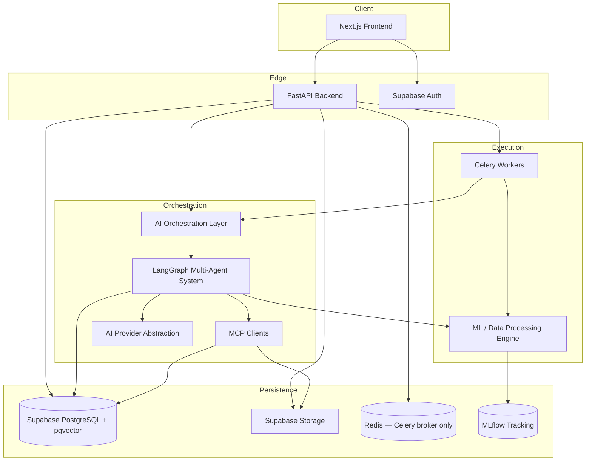
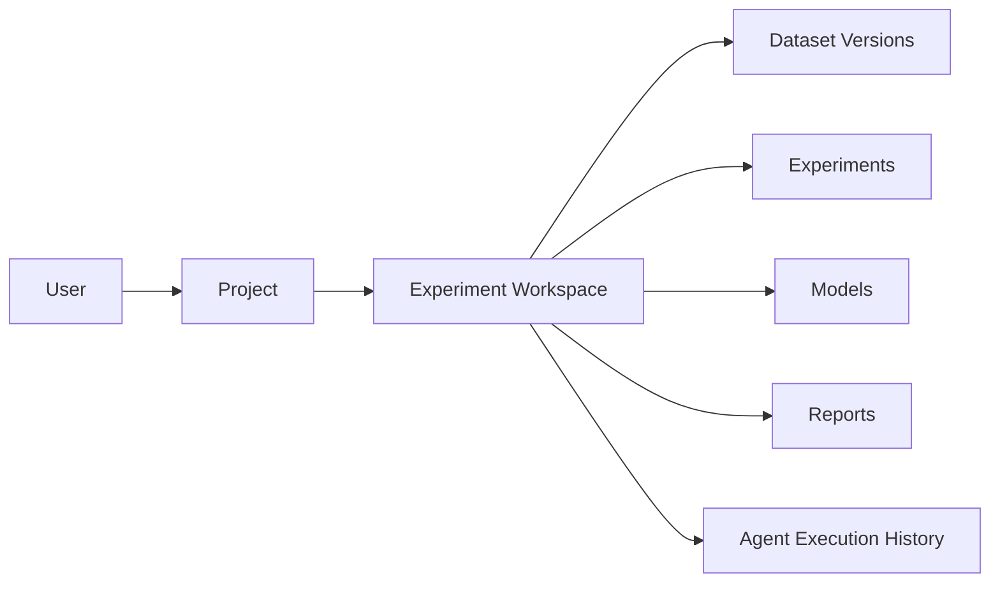

# 00 — Product & Architecture Overview

## 1. Product vision

Syntrix AI is a **portfolio-level autonomous AI data intelligence platform**. It presents as a virtual analytics team: users bring data; the platform plans and executes analysis, modeling, explanation, research, and reporting with transparent agent activity.

### Primary user journeys

1. **Upload & understand** — ingest CSV/Parquet/Excel (later: DB connectors), profile schema, quality, and semantics.
2. **Explore & analyze** — automated EDA, statistical tests, insight cards, visualizations.
3. **Train & compare** — AutoML-style experiments across task types and algorithms; track in MLflow.
4. **Explain & predict** — SHAP/LIME explanations; batch/single prediction APIs.
5. **Report & recommend** — narrative reports (Markdown + PDF), improvement recommendations, conversation memory across sessions.

### Non-goals (v1)

- Real-time streaming feature store / online inference at massive scale
- Fully unsupervised multi-tenant SaaS billing/marketplace
- Replacing enterprise BI suites (Tableau/Power BI) as a visual canvas
- Training foundation LLMs in-house

## 2. Design principles

| Principle | Implication |
|-----------|-------------|
| **Autonomy with observability** | Agents act, but every step is logged, streamable, and auditable |
| **Separation of concerns** | API, orchestration, ML execution, and tool servers are distinct deployables |
| **Clean boundaries** | Backend uses Clean Architecture; engines expose clear service contracts |
| **Async by default** | Long work (train, full AutoML, reports) runs via Celery; UI gets SSE/poll |
| **Security first** | AuthZ via Supabase RLS + API checks; upload sandboxing; tool allowlists |
| **Portfolio honesty** | Architecture is production-minded; scope is phased to a strong demo |

## 3. Logical architecture (one glance)

## 4. Major technology decisions

> **Status:** The decisions below are **approved** (Phase 0 locked). Implementation still awaits explicit Phase 1 kickoff.

### 4.1 `ai-engine` vs `ml-engine`

| Concern | `ai-engine` | `ml-engine` |
|---------|-------------|-------------|
| Responsibility | Reasoning, planning, agent graph, tool use, memory retrieval | Deterministic data/ML computation |
| Primary tech | LangGraph, LLM provider adapters, MCP client adapters | pandas/polars, scikit-learn, boosters, SHAP/LIME, MLflow |
| Determinism | Stochastic (LLM-guided) | Reproducible pipelines with seeds/configs |
| Failure mode | Retry, replan, escalate to human | Raise typed pipeline errors; no silent fallback |

**Why split:** Keeps LLM orchestration independent of heavy numerical stacks; allows Celery workers to import only what a job needs; clarifies testing (agent mocks vs numerical fixtures).

### 4.2 Domain model: Project → Experiment Workspace → artifacts

| Concept | Role |
|---------|------|
| **Project** | Top-level ownership container (portfolio unit). Holds settings, membership (future), and one or more workspaces. |
| **Experiment Workspace** | First-class **analysis unit**. Groups dataset versions, experiments, models, reports, and agent execution history for a coherent investigation. |
| **Artifacts** | Versioned datasets, ML runs, trained models, Markdown/PDF reports, and workspace-scoped agent runs. |

**Decision (approved):** All analysis workflows are **workspace-scoped**. Projects organize workspaces; agents, jobs, and durable artifacts attach to a workspace (with `project_id` denormalized for RLS/list performance).

### 4.3 Vector memory: PostgreSQL + pgvector

| Criterion | PostgreSQL + pgvector | Separate vector DB (e.g. ChromaDB) |
|-----------|----------------------|-----------------------------------|
| Persistence & metadata filters | First-class SQL + RLS | Extra service + sync risk |
| Ops complexity for portfolio | Low (same Supabase Postgres) | Extra container/backup surface |
| Multi-tenancy | Row-level filters by `user_id` / `project_id` / `workspace_id` | Collection/metadata discipline |
| Consistency | Same transactions as business entities | Dual-write complexity |

**Decision (approved):** Use **PostgreSQL + pgvector** for agent/conversation/workspace memory and RAG embeddings. No ChromaDB (or other external vector DB) as a required dependency. Scale path remains Postgres (indexes, partitioning) unless corpus growth later justifies a dedicated ANN service.

### 4.4 Object storage: Supabase Storage

**Decision (approved):** **Supabase Storage** is the primary object store for datasets, model artifacts (app-facing paths), and report files (Markdown + PDF). MCP File access resolves through Supabase Storage (or a local cache mirrored from it)—not MinIO/S3/local filesystem as the primary store.

### 4.5 AI provider abstraction

**Decision (approved):**

| Role | Choice |
|------|--------|
| Primary local provider | **Ollama** |
| Optional remote providers | **OpenAI-compatible APIs** (OpenAI, Azure OpenAI-compatible endpoints, etc.) |
| Integration pattern | Interface / adapter in `ai-engine` (and thin backend config) |
| Selection | Environment-driven (`AI_PROVIDER`, base URL, model names)—**no hardcoded vendor lock-in** |

Agents and graphs depend only on the abstraction (`ChatModel` / `EmbeddingModel` ports). Concrete adapters wrap Ollama and OpenAI-compatible clients.

### 4.6 LangGraph checkpoint persistence: PostgreSQL

**Decision (approved):** LangGraph checkpointer state is stored in **PostgreSQL** (Supabase). Redis is **not** used for graph checkpoints.

### 4.7 Redis scope: Celery only

**Decision (approved):** Redis is used **only** as the Celery broker / task queue for background jobs. It is **not** used for vector memory, LangGraph checkpoints, or primary durable application state. Durable progress and job status live in Postgres (`jobs`, `agent_runs`, etc.).

### 4.8 Reports: Markdown + PDF in v1

**Decision (approved):** Report generation supports **both Markdown and PDF** in v1 scope (not Markdown-only first). Storage holds both formats (or PDF derived from Markdown) under Supabase Storage; API exposes download for each.

### 4.9 Supabase Cloud vs local Postgres in Docker

| Environment | Postgres / Auth / Storage | Compose services |
|-------------|---------------------------|------------------|
| **Local / demo** | Supabase Cloud (preferred) *or* local Supabase CLI | App services + Redis (Celery) + MLflow + Ollama (optional) |
| **Docker Compose** | Redis, MLflow, API, workers, frontend; optional Ollama | Heavy stateful DB/Auth/Storage stay on Supabase unless offline-only mode |
| **Offline fallback** | `postgres` + stub auth only for emergency | Documented as optional; not default |

**Decision (approved):** Default to **Supabase Cloud** for PostgreSQL (+ pgvector), Auth, and Storage. Compose runs app services + Redis (Celery broker) + MLflow (+ optional Ollama). No ChromaDB container.

### 4.10 Where Celery workers live

- **Process:** Dedicated `worker` containers (`docker/workers`) sharing the Python workspace packages (`backend`, `ai-engine`, `ml-engine`, `mcp` clients).
- **Queues:** `default`, `ml_train`, `reports`, `agents` for isolation and priority.
- **API role:** Enqueue only; never run long training on the request thread.
- **Why not nest workers inside FastAPI:** Avoids Gunicorn/Uvicorn process coupling and enables horizontal scale of CPU-heavy ML jobs.

### 4.11 Streaming model

- **SSE** from FastAPI for agent step updates and job progress (simpler through proxies than raw WebSockets for one-way streams).
- **WebSocket** optional later for bidirectional chat typing indicators / cancel—not required for v1.
- **Polling** (`GET /jobs/{id}`) as universal fallback.

### 4.12 Frontend UX posture

Premium **dark enterprise** UI: dense but calm analytics surfaces, workspace-centric navigation, agent activity timeline, Plotly/Recharts for charts, Framer Motion for purposeful transitions (run start, agent handoff, insight reveal)—not decorative noise.

## 5. Security baseline

- Secrets only via environment variables / secret managers; never committed.
- Supabase JWT validation on every protected API route.
- Resource ownership checks at service layer **and** RLS on Postgres (including embedding/memory rows).
- Upload limits, MIME/extension allowlists, virus-scan hook point (ClamAV optional), path traversal prevention.
- MCP tools run with scoped credentials and sandbox paths per project/workspace; File MCP backs onto Supabase Storage.
- Rate limiting at API edge; CORS locked to frontend origin(s).

## 6. Remaining open decisions (non-blocking defaults preferred)

Phase 0 technology decisions in §4 are **approved**. Only the following remain open; they may be deferred with documented defaults at Phase 1 kickoff:

1. **Local Supabase CLI** vs cloud-only for developer onboarding (default: cloud project + migrations).
2. **Multi-tenancy depth:** single-user portfolio accounts vs org/team roles in schema v1 (default: owner-only RLS; `project_members` later).

## 7. Related documents

- [01-system-architecture.md](./01-system-architecture.md)
- [02-database-schema.md](./02-database-schema.md)
- [07-development-roadmap.md](./07-development-roadmap.md)
