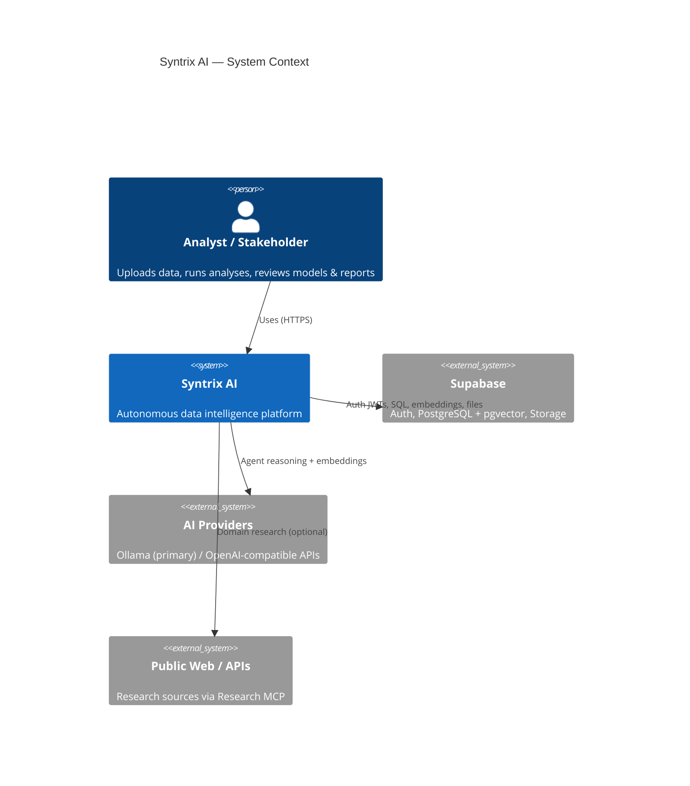
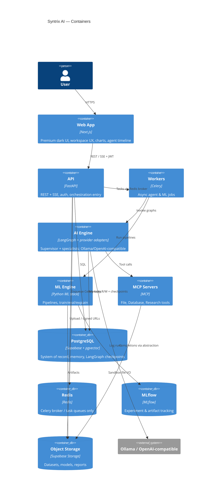
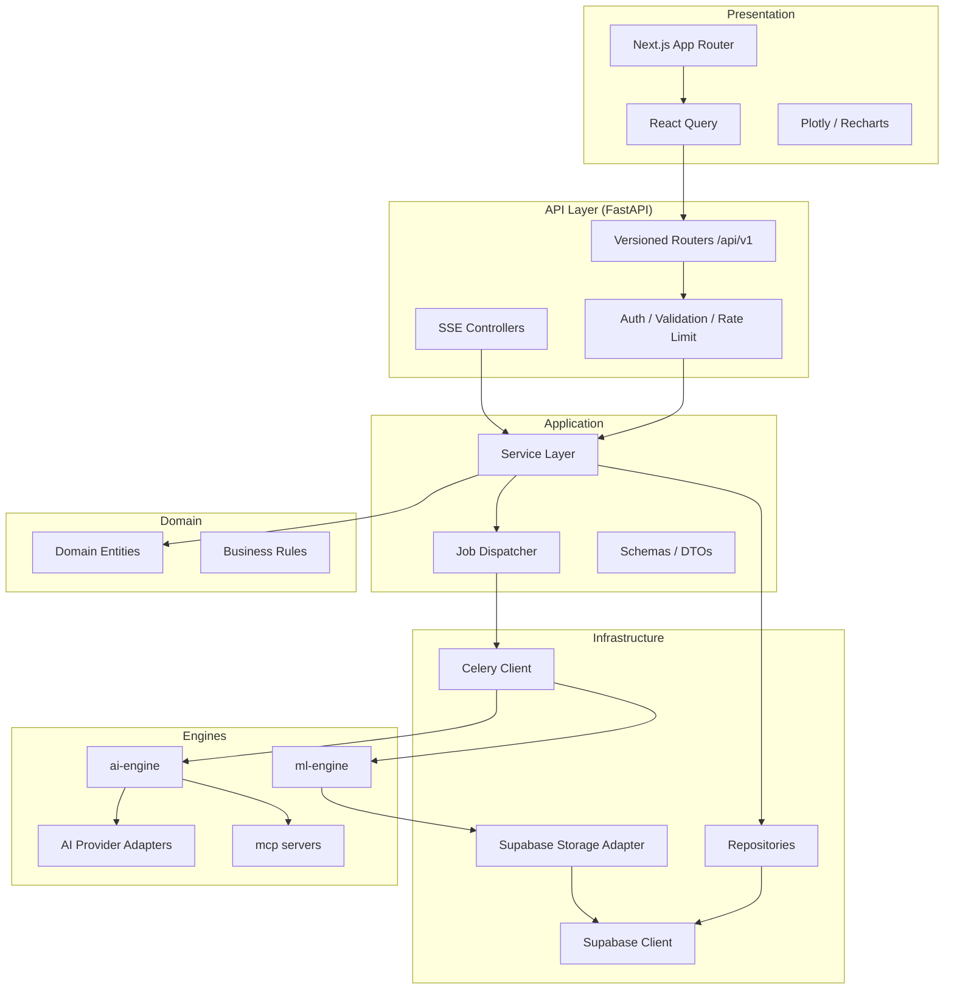
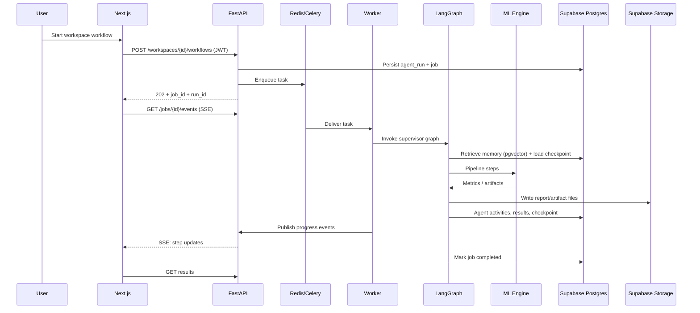
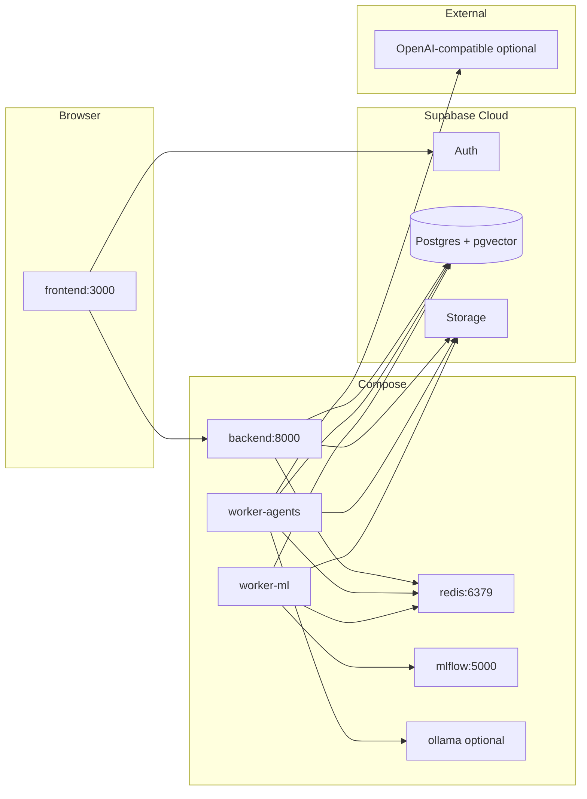
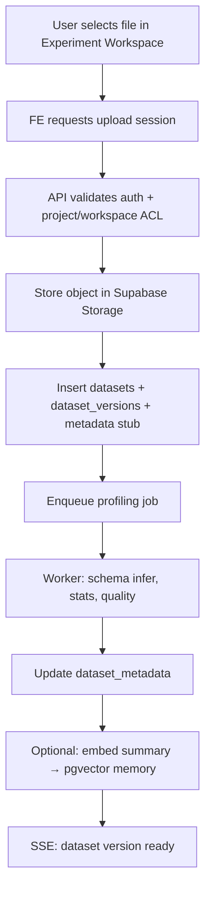
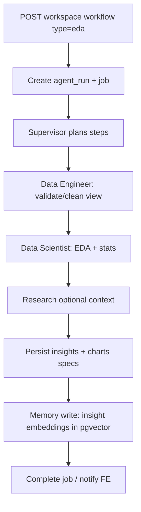
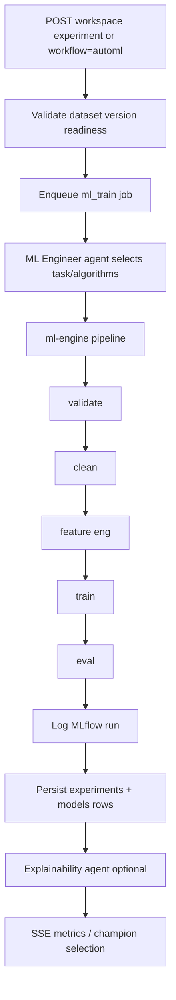
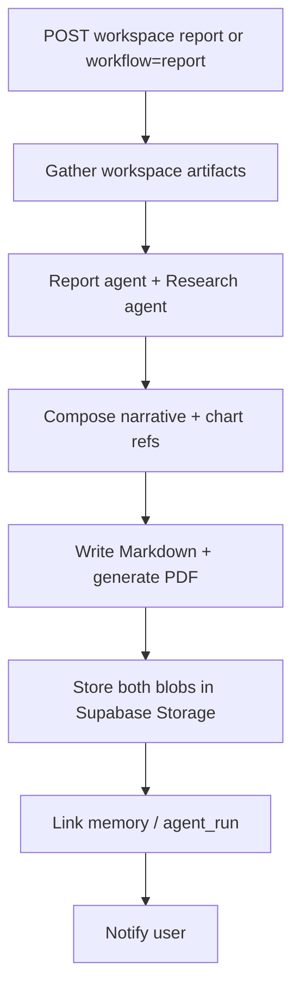
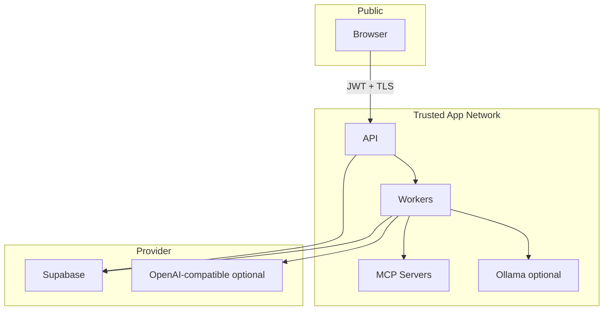

# 01 — System Architecture

## 1. Purpose

This document defines the production-minded layered architecture for Syntrix AI: component boundaries, runtime topology, and end-to-end data flows for core journeys.

## 2. C4 Context

## 3. C4 Container view

## 4. Layered application architecture

### Backend Clean Architecture mapping

| Layer | Package (planned) | Allowed dependencies |
|-------|-------------------|----------------------|
| API | `backend/app/api` | Services, DTOs |
| Domain | `backend/app/domain` | None (pure) |
| Services | `backend/app/services` | Domain, repository interfaces, job ports |
| Repositories | `backend/app/repositories` | Supabase/Postgres adapters |
| Core | `backend/app/core` | Config, security, logging |
| Workers | `backend/app/workers` | Services, ai-engine, ml-engine |

### AI provider abstraction (ai-engine)

| Port | Responsibility |
|------|----------------|
| `ChatModel` | Completions / tool-capable chat |
| `EmbeddingModel` | Vector embeddings for memory/RAG |
| `OllamaAdapter` | Primary local implementation |
| `OpenAICompatibleAdapter` | Optional remote OpenAI-compatible APIs |

Selection via env (`AI_PROVIDER`, `AI_BASE_URL`, `AI_MODEL`, `EMBEDDING_MODEL`, API keys). Graphs and agents never import a vendor SDK directly.

## 5. Component interaction (runtime)

## 6. Deployment topology (Docker Compose + Supabase Cloud)

> **Locked:** App Postgres/Auth/Storage run on **Supabase Cloud only**. Compose does **not** include a Postgres container for the application database.

### Service responsibilities

| Service | Role | Scale notes |
|---------|------|-------------|
| `frontend` | SSR/CSR UI | Stateless; CDN-friendly |
| `backend` | Sync API + SSE | Scale horizontally behind LB |
| `worker-agents` | LangGraph jobs | Scale on I/O / LLM concurrency |
| `worker-ml` | Train/eval/explain | Scale on CPU/GPU; separate queue |
| `redis` | **Celery broker / queues only** | Not for vectors, checkpoints, or durable app state |
| `mlflow` | Tracking server + artifact root | Not the system of record for business entities |
| `ollama` (optional) | Local LLM/embeddings | Host GPU/CPU; primary AI provider in demos |

**Not in Compose:** ChromaDB or other external vector DB. Vector search runs in Supabase Postgres via pgvector.

**MLflow vs app DB:** Business entities (workspaces, experiments, models, reports, agent runs) live in Supabase. MLflow stores training metrics/params/artifacts for MLOps fidelity; app tables hold user-facing links (`mlflow_run_id`).

**Redis scope (approved):** Celery task queues / background job delivery only. Job status, progress, LangGraph checkpoints, and memory are Postgres-backed.

## 7. Key journey data flows

### 7.1 Upload dataset (into a workspace)

**Security controls:** size/MIME allowlist; virus-scan hook; per-project/workspace storage prefix in Supabase Storage; no executable content served from storage as HTML.

### 7.2 Run analysis (EDA / insights)

### 7.3 Train model

**Supported task families (engine contract):** classification, regression, clustering, forecasting, anomaly detection.

**Algorithm palette:** Random Forest, XGBoost, LightGBM, CatBoost, Logistic Regression, SVM, Neural Network (sklearn MLP or lightweight torch—implementation choice in Phase 3).

### 7.4 Generate report (Markdown + PDF)

## 8. Cross-cutting concerns

### Scalability

- Stateless API; horizontal workers by queue.
- Dataset processing streams/chunks large files (polars preferred later).
- Cache dataset profiles in Postgres (`dataset_metadata`) keyed by `dataset_id` / `dataset_version_id` + content hash (not Redis).
- Memory embeddings partitioned/filtered by `workspace_id` (+ `project_id` / `user_id`).

### Maintainability

- Strict package boundaries; no FE importing engine code.
- Versioned API; additive schema migrations.
- Shared typed contracts (OpenAPI + JSON schemas for workflow configs).
- Agent prompts, tool schemas, and provider adapters versioned alongside graphs.

### Observability

- Structured JSON logs with `request_id`, `job_id`, `run_id`, `workspace_id`, `agent_name`.
- `system_logs` + `agent_activities` / `agent_runs` tables for product UI timelines.
- Optional OpenTelemetry hooks on API and workers (Phase 4+).

### Resilience

- Celery retries with exponential backoff for transient LLM/network errors.
- Idempotent job handlers via `job_id`.
- Dead-letter visibility in admin/system logs.
- Human-in-the-loop pause states in LangGraph for ambiguous schema/target selection; checkpoints in PostgreSQL.

## 9. Trust boundaries

MCP servers are **not** exposed to the public internet. Only workers/API invoke them over internal network (stdio or internal HTTP).

## 10. Related documents

- [02-database-schema.md](./02-database-schema.md)
- [04-api-architecture.md](./04-api-architecture.md)
- [05-ai-agent-workflow.md](./05-ai-agent-workflow.md)
- [06-mcp-architecture.md](./06-mcp-architecture.md)
