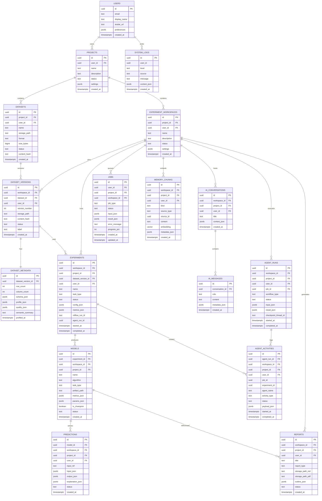

# 02 — Database Schema Design

## 1. Purpose

Relational system of record on **Supabase PostgreSQL** (with **pgvector** for embeddings). Business entities, auth-linked ownership, RLS, and indexes are defined here. Design DDL also lives in [`database/schema.sql`](../database/schema.sql) (design artifact only—not applied).

## 2. Conventions

| Convention | Role |
|------------|------|
| PKs | `uuid` default `gen_random_uuid()` |
| Timestamps | `timestamptz` `created_at` / `updated_at` |
| Soft delete | `deleted_at timestamptz NULL` where user-facing recovery matters |
| Ownership | Most tables carry `user_id` and/or `project_id`; analysis artifacts also carry `workspace_id` |
| Auth link | `users.id` mirrors `auth.users.id` (Supabase) |
| Enums | Postgres enums or check constraints; prefer enums for status fields |
| JSON | `jsonb` for flexible metadata, chart specs, metrics blobs |
| Vectors | `vector(n)` via **pgvector**; dimension fixed per embedding model (config-driven) |
| Money/PII | No payment data in v1; minimize PII beyond auth email |

## 3. Domain hierarchy

```text
User
 └── Project                         # ownership / portfolio container
      └── Experiment Workspace       # analysis unit
           ├── Dataset Versions      # pinned data snapshots used in the workspace
           ├── Experiments
           ├── Models
           ├── Reports (Markdown + PDF)
           └── Agent Execution History (agent_runs + activities)
```

| Concept | Meaning |
|---------|---------|
| **Project** | Top-level container owned by a user. Organizes multiple workspaces. |
| **Experiment Workspace** | First-class product unit for a coherent investigation. Workflows, jobs, and artifacts are workspace-scoped. |
| **Dataset** | Project-level uploaded asset (logical dataset). |
| **Dataset Version** | Immutable (or append-only) snapshot linked into a workspace for reproducible experiments. |
| **Agent Run** | One execution of a LangGraph workflow within a workspace; ties to `jobs` and activities. |

Raw uploads may live at project scope (`datasets`); analysis always pins a **dataset version** inside a workspace.

## 4. ER diagram



> LangGraph’s Postgres checkpointer may create its own checkpoint tables (e.g. via LangGraph persistence). Application-level `agent_runs.checkpoint_thread_id` correlates product runs with that store. Redis is **not** used for checkpoints.

## 5. Table specifications

### 5.1 `users`

Public profile mirror of Supabase Auth.

| Column | Type | Notes |
|--------|------|-------|
| `id` | uuid PK | `= auth.users.id` |
| `email` | text unique | Synced from auth |
| `display_name` | text | |
| `avatar_url` | text null | |
| `preferences` | jsonb | UI/theme, default project/workspace |
| `created_at` / `updated_at` | timestamptz | |

**Trigger (design):** on `auth.users` insert → upsert `public.users`.

### 5.2 `projects`

| Column | Type | Notes |
|--------|------|-------|
| `id` | uuid PK | |
| `user_id` | uuid FK → users | Owner |
| `name` | text | |
| `description` | text null | |
| `status` | enum | `active`, `archived` |
| `settings` | jsonb | default prefs |
| `deleted_at` | timestamptz null | soft delete |

**Indexes:** `(user_id, created_at desc)`, unique `(user_id, lower(name))` where `deleted_at is null` (optional).

### 5.3 `experiment_workspaces`

First-class analysis unit under a project.

| Column | Type | Notes |
|--------|------|-------|
| `id` | uuid PK | |
| `project_id` | uuid FK | |
| `user_id` | uuid FK | denormalized for RLS |
| `name` | text | |
| `description` | text null | |
| `status` | enum | `active`, `archived` |
| `settings` | jsonb | workflow defaults, HITL flags |
| `deleted_at` | timestamptz null | |

**Indexes:** `(project_id, created_at desc)`, unique `(project_id, lower(name))` where not deleted (optional).

### 5.4 `datasets`

Project-level uploaded asset (logical dataset). Storage path points to **Supabase Storage**.

| Column | Type | Notes |
|--------|------|-------|
| `id` | uuid PK | |
| `project_id` | uuid FK | |
| `user_id` | uuid FK | denormalized for RLS |
| `name` | text | |
| `storage_path` | text | Supabase Storage object key (latest upload convenience) |
| `format` | text | `csv`, `parquet`, `xlsx` |
| `size_bytes` | bigint | |
| `status` | enum | `uploading`, `profiling`, `ready`, `failed`, `deleted` |
| `content_hash` | text null | dedupe / cache key |
| `original_filename` | text | |
| `mime_type` | text | |

**Indexes:** `(project_id, created_at desc)`, `(content_hash)`.

### 5.5 `dataset_versions`

Workspace-scoped, versioned pin of a dataset for reproducible analysis.

| Column | Type | Notes |
|--------|------|-------|
| `workspace_id` | uuid FK | |
| `dataset_id` | uuid FK | parent logical dataset |
| `project_id`, `user_id` | uuid | denormalized |
| `version_number` | int | monotonic per dataset within workspace (or per dataset globally—service enforces) |
| `label` | text null | e.g. `v1-clean`, `baseline` |
| `storage_path` | text | immutable object key for this version |
| `content_hash` | text | |
| `status` | enum | `profiling`, `ready`, `failed`, `superseded` |
| `notes` | text null | |

**Indexes:** `(workspace_id, created_at desc)`, unique `(workspace_id, dataset_id, version_number)`.

### 5.6 `dataset_metadata`

1:1 with **dataset version** after profiling.

| Column | Type | Notes |
|--------|------|-------|
| `dataset_version_id` | uuid unique FK | |
| `row_count` / `column_count` | int | |
| `schema_json` | jsonb | columns, dtypes, nullability |
| `profile_json` | jsonb | distributions, correlations summary |
| `quality_json` | jsonb | missingness, outliers, duplicates |
| `semantic_summary` | text | LLM/agent summary |
| `target_candidates` | jsonb | suggested targets |
| `profiled_at` | timestamptz | |

### 5.7 `experiments`

| Column | Type | Notes |
|--------|------|-------|
| `workspace_id`, `project_id`, `user_id` | uuid | |
| `dataset_version_id` | uuid FK | required pin |
| `name` | text | |
| `task_type` | enum | classification, regression, clustering, forecasting, anomaly |
| `status` | enum | pending, running, completed, failed, cancelled |
| `config_json` | jsonb | features, target, algorithms, CV |
| `metrics_json` | jsonb | best metrics snapshot |
| `mlflow_run_id` | text null | |
| `agent_run_id` | uuid null | link to agent execution |
| `job_id` | uuid null | |
| `started_at` / `completed_at` | timestamptz | |

**Indexes:** `(workspace_id, created_at desc)`, `(dataset_version_id)`, `(status)`.

### 5.8 `models`

| Column | Type | Notes |
|--------|------|-------|
| `experiment_id` | uuid FK | |
| `workspace_id`, `project_id` | uuid FK | |
| `name` | text | |
| `algorithm` | text | rf, xgboost, lightgbm, … |
| `task_type` | enum | |
| `artifact_path` | text | Supabase Storage / MLflow artifact URI |
| `metrics_json` / `params_json` | jsonb | |
| `feature_schema_json` | jsonb | for inference validation |
| `is_champion` | boolean default false | one champion per experiment via service / partial unique |
| `status` | enum | training, ready, failed, archived |

**Indexes:** `(experiment_id)`, `(workspace_id, is_champion)` where ready.

### 5.9 `predictions`

| Column | Type | Notes |
|--------|------|-------|
| `model_id`, `workspace_id`, `project_id`, `user_id` | uuid | |
| `job_id` | uuid null | async batch |
| `input_ref` | text null | storage path for batch |
| `input_json` | jsonb null | small single-row |
| `output_json` | jsonb | predictions |
| `explanation_json` | jsonb null | SHAP/LIME payload |
| `status` | enum | pending, running, completed, failed |

### 5.10 `reports`

v1 supports **both Markdown and PDF**.

| Column | Type | Notes |
|--------|------|-------|
| `workspace_id`, `project_id`, `user_id` | uuid | |
| `title` | text | |
| `report_type` | enum | eda, experiment, executive, custom |
| `storage_path_md` | text null | Supabase Storage key for `.md` |
| `storage_path_pdf` | text null | Supabase Storage key for `.pdf` |
| `outline_json` | jsonb | sections |
| `content_md` | text null | inline small reports (optional) |
| `related_experiment_ids` | uuid[] null | |
| `related_model_ids` | uuid[] null | |
| `agent_run_id` | uuid null | |
| `status` | enum | drafting, ready, failed |

### 5.11 `ai_conversations` / `ai_messages`

| Table | Key columns |
|-------|-------------|
| `ai_conversations` | `workspace_id`, `project_id`, `user_id`, `title`, `context_json` (pinned dataset_version/model ids) |
| `ai_messages` | `conversation_id`, `role` (`user`/`assistant`/`system`/`tool`), `content`, `metadata_json` |

**Indexes:** messages `(conversation_id, created_at)`.

### 5.12 `agent_runs` (execution history)

First-class agent execution history for a workspace.

| Column | Type | Notes |
|--------|------|-------|
| `workspace_id`, `project_id`, `user_id` | uuid | |
| `job_id` | uuid null FK → jobs | |
| `workflow_type` | text | `eda`, `automl`, `explain`, `report`, `chat`, `custom` |
| `status` | enum | queued, running, waiting_human, succeeded, failed, cancelled |
| `input_json` / `result_json` | jsonb | |
| `checkpoint_thread_id` | text null | LangGraph Postgres checkpointer thread key |
| `error_message` | text null | |
| `started_at` / `completed_at` | timestamptz | |

**Indexes:** `(workspace_id, created_at desc)`, `(job_id)`, `(status)`.

### 5.13 `agent_activities`

UI timeline + audit of agent steps within a run.

| Column | Type | Notes |
|--------|------|-------|
| `agent_run_id` | uuid FK | preferred parent |
| `workspace_id`, `project_id`, `user_id` | uuid | |
| `job_id` | uuid null | |
| `experiment_id` | uuid null | |
| `conversation_id` | uuid null | |
| `agent_name` | text | supervisor, data_engineer, … |
| `activity_type` | text | plan, tool_call, handoff, checkpoint, error |
| `status` | enum | started, succeeded, failed, waiting_human |
| `payload_json` | jsonb | truncated tool I/O, messages |
| `started_at` / `completed_at` | timestamptz | |

**Indexes:** `(workspace_id, started_at desc)`, `(agent_run_id)`, `(job_id)`.

### 5.14 `memory_chunks` (pgvector)

Replaces external vector DB collections. Used for project/workspace/conversation memory and RAG.

| Column | Type | Notes |
|--------|------|-------|
| `workspace_id`, `project_id`, `user_id` | uuid | tenancy filters |
| `kind` | text | `dataset_summary`, `insight`, `recommendation`, `conversation`, … |
| `source_type` / `source_id` | text / uuid null | join-back to SQL entities |
| `conversation_id` | uuid null | when conversation-scoped |
| `content` | text | chunk text |
| `embedding` | vector(n) | dimension from embedding model config |
| `metadata_json` | jsonb | extra filters |
| `created_at` | timestamptz | |

**Indexes:** HNSW or IVFFlat on `embedding` (choose at migration time); btree `(workspace_id, kind)`; optional `(conversation_id)`.

### 5.15 `system_logs`

| Column | Type | Notes |
|--------|------|-------|
| `user_id` | uuid null | |
| `level` | text | debug/info/warn/error |
| `source` | text | api, worker, mcp, ml-engine |
| `message` | text | |
| `context_json` | jsonb | request_id, workspace_id, stack summary |
| `created_at` | timestamptz | |

Retention: partition or scheduled purge (e.g., 30–90 days).

### 5.16 `jobs`

| Column | Type | Notes |
|--------|------|-------|
| `user_id`, `project_id`, `workspace_id` | uuid | workspace required for analysis jobs |
| `celery_task_id` | text null | |
| `job_type` | text | profile_dataset, eda, automl, predict, report, … |
| `status` | enum | queued, running, succeeded, failed, cancelled |
| `progress_pct` | int 0–100 | durable in Postgres (not Redis) |
| `input_json` / `result_json` | jsonb | |
| `error_message` | text null | |
| `created_at` / `updated_at` | timestamptz | |

## 6. Relationships summary

- User **owns** many Projects.
- Project **contains** Experiment Workspaces and Datasets.
- Workspace **pins** Dataset Versions; **runs** Experiments, Agent Runs, Jobs; **hosts** Conversations; **generates** Reports; **stores** Memory Chunks.
- Dataset Version **has one** Metadata; **used by** many Experiments.
- Experiment **produces** many Models; at most one champion (service + optional DB constraint).
- Model **serves** many Predictions.
- Agent Run **contains** Activities; correlates with Job and LangGraph checkpoint thread.
- Conversations **contain** Messages.

## 7. RLS considerations (Supabase)

Enable RLS on all user data tables. Pattern:

```sql
-- Pseudocode policy pattern
create policy "owner_select" on projects
  for select using (auth.uid() = user_id);

create policy "owner_all" on experiment_workspaces
  for all using (auth.uid() = user_id)
  with check (auth.uid() = user_id);
```

### Policy matrix (v1: owner-only)

| Table | SELECT | INSERT | UPDATE | DELETE |
|-------|--------|--------|--------|--------|
| users | own row | trigger/service | own | deny |
| projects / experiment_workspaces | owner | owner | owner | owner (soft) |
| datasets / dataset_versions / dataset_metadata | owner | owner | owner | owner |
| experiments / models / predictions / reports | owner | owner | owner | owner |
| agent_runs / agent_activities / jobs / memory_chunks / ai_* | owner | owner/service | owner/service | limited |
| system_logs | own or admin | service role | deny | deny |

**Service role:** Celery workers use a server-side Supabase service key (or direct Postgres with RLS bypass) **only** after API has already authorized the job for that `user_id`/`project_id`/`workspace_id`. Workers must still stamp ownership correctly; never accept client-supplied ownership without verification at enqueue time.

**Future orgs (deferred — not in v1 migrations):** introduce `project_members (project_id, user_id, role)` and optionally `organizations`; switch RLS from `auth.uid() = user_id` to membership. v1 keeps a single `user_id` owner column on resources (no unused `organization_id` / membership tables). Extension is documented only until a later phase explicitly adds it.

## 8. Indexing & performance notes

- Prefer composite indexes matching list endpoints: `(workspace_id, created_at desc)`, `(project_id, created_at desc)`.
- GIN indexes on `jsonb` only where filtered—avoid premature GIN.
- `content_hash` for dataset / version dedupe.
- Partial index: `models (workspace_id) where is_champion and status = 'ready'`.
- pgvector: start with HNSW for memory search; tune lists/m for corpus size.

## 9. Vector memory (in Postgres)

**Approved:** embeddings live in `memory_chunks` (pgvector). No ChromaDB (or other external vector store) as a required dependency.

| Kind filters | Typical content |
|--------------|-----------------|
| `dataset_summary` | version summaries |
| `insight` | EDA / analysis insight cards |
| `recommendation` | improvement suggestions |
| `conversation` | chunked message embeddings |

Document/source IDs reference SQL entity IDs for join-back in the app layer. Filters always include `workspace_id` (and `user_id` / `project_id` for RLS).

## 10. Related artifacts

- DDL sketch: [`database/schema.sql`](../database/schema.sql)
- API usage: [04-api-architecture.md](./04-api-architecture.md)
