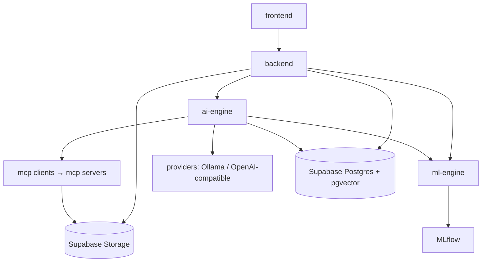

# 03 — Folder Structure & Module Responsibilities

## 1. Purpose

Defines the monorepo layout for Syntrix AI. Physical empty directories (with `.gitkeep`) already exist to lock structure before implementation. **No application source code is present.**

## 2. Top-level tree

```
Syntrix-AI/
├── ARCHITECTURE.md          # Pointer to docs/
├── README.md                # Concise product intro + status
├── frontend/                # Next.js application
├── backend/                 # FastAPI API + workers entrypoints
├── ai-engine/               # LangGraph agents, graphs, providers, memory
├── ml-engine/               # ML/data pipelines (deterministic)
├── mcp/                     # MCP servers (File, Database, Research)
├── database/                # Schema design, migrations (future), seeds
├── docs/                    # Architecture documentation (this set)
├── docker/                  # Dockerfiles & Compose definitions
└── tests/                   # Cross-cutting / e2e tests
```

## 3. Detailed layout (recommended at implementation time)

```
Syntrix-AI/
├── frontend/
│   ├── public/
│   ├── src/
│   │   ├── app/                 # App Router pages/layouts
│   │   ├── components/          # UI (shadcn + domain components)
│   │   ├── features/            # projects, workspaces, datasets, experiments, …
│   │   ├── hooks/
│   │   ├── lib/                 # API client, auth helpers
│   │   ├── styles/
│   │   └── types/
│   ├── package.json             # (future)
│   └── ...
│
├── backend/
│   ├── app/
│   │   ├── api/                 # Routers: /api/v1/*
│   │   │   └── v1/
│   │   ├── core/                # Config, security, logging, deps
│   │   ├── domain/              # Entities (Project, Workspace, …), errors
│   │   ├── services/            # Use-cases / application services
│   │   ├── repositories/        # Postgres/Supabase + Storage adapters
│   │   └── workers/             # Celery app, tasks, progress publishers
│   └── ...
│
├── ai-engine/
│   ├── agents/                  # Supervisor + specialists
│   ├── graphs/                  # Compiled LangGraph definitions
│   ├── state/                   # Graph state schemas
│   ├── tools/                   # Tool wrappers over MCP clients
│   ├── providers/               # AI provider abstraction + adapters
│   │   ├── base.py              # ChatModel / EmbeddingModel ports
│   │   ├── ollama.py            # Primary local adapter
│   │   └── openai_compatible.py # Optional OpenAI-compatible adapter
│   ├── memory/                  # pgvector retrievers / writers
│   └── checkpoints/             # Postgres checkpointer wiring
│
├── ml-engine/
│   ├── pipelines/               # validate→…→predict orchestration
│   ├── models/                  # Algorithm adapters
│   ├── features/                # Feature engineering
│   ├── evaluation/              # Metrics, comparison
│   ├── explainability/          # SHAP, LIME
│   └── reporting/               # Markdown + PDF generation helpers
│
├── mcp/
│   ├── file/                    # File MCP server (Supabase Storage)
│   ├── database/                # Database MCP server
│   └── research/                # Research MCP server
│
├── database/
│   ├── schema.sql               # Design-level DDL sketch
│   ├── migrations/              # Future Supabase/CLI migrations
│   └── seeds/                   # Demo seed designs
│
├── docker/
│   ├── compose/                 # docker-compose.yml (future; no ChromaDB)
│   ├── frontend/
│   ├── backend/
│   ├── workers/
│   ├── mlflow/
│   └── ollama/                  # Optional local LLM service
│
├── docs/                        # Architecture package
│   └── diagrams/                # Optional exported diagrams
│
└── tests/
    ├── unit/
    ├── integration/
    ├── e2e/
    └── fixtures/
```

## 4. Responsibility matrix

| Directory | Owns | Must not own |
|-----------|------|--------------|
| `frontend/` | UX (project → workspace), charts, auth session UX, SSE consumption | Direct DB access, raw LLM keys |
| `backend/` | HTTP/SSE, authZ, jobs enqueue, persistence orchestration | Heavy training loops, MCP server processes |
| `ai-engine/` | Agent reasoning, graph control flow, provider adapters, pgvector memory, Postgres checkpoints | Low-level model fitting internals |
| `ml-engine/` | Deterministic ML/data transforms, metrics, explanations, report PDF render | Prompting / agent planning |
| `mcp/` | Tool protocols & sandboxed side effects (Storage/SQL/web) | Business workflow decisions |
| `database/` | Schema & migration artifacts | Runtime app logic |
| `docker/` | Container packaging & local topology (Redis for Celery only) | Business rules |
| `tests/` | Cross-package contracts & e2e | Production runtime |
| `docs/` | Design truth | Executable product code |

## 5. Dependency direction



Rules:

1. `ml-engine` has **no** dependency on `ai-engine` or `frontend`.
2. `ai-engine` may call `ml-engine` for compute steps (including Markdown/PDF report helpers).
3. `mcp` servers depend only on Supabase Storage/DB clients and allowlisted network for research.
4. `backend` is the composition root for HTTP; workers are a second composition root for async tasks.
5. Vendor LLM SDKs live only under `ai-engine/providers/` adapters.

## 6. Package management strategy (planned)

| Area | Tooling |
|------|---------|
| Frontend | npm/pnpm + TypeScript |
| Python packages | Prefer **uv** or poetry workspaces: `backend`, `ai-engine`, `ml-engine`, `mcp-*` as installable packages |
| Shared Python types | Thin shared `contracts` package optional later—avoid premature abstraction |

## 7. Environment & config placement (planned)

- Root `.env.example` documenting all secrets (never commit real `.env`).
- AI provider selection: `AI_PROVIDER=ollama|openai_compatible`, base URLs, model names, optional API keys.
- Per-service overrides via Compose `env_file`.
- Frontend only receives public Supabase URL + anon key; all privileged keys stay server-side.

## 8. What exists today

Empty directory scaffolding with `.gitkeep` files matching the structure above. Implementation files are intentionally absent pending Phase 1 kickoff ([roadmap](./07-development-roadmap.md)).
