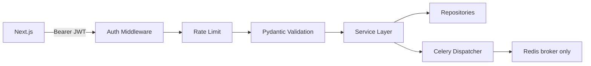
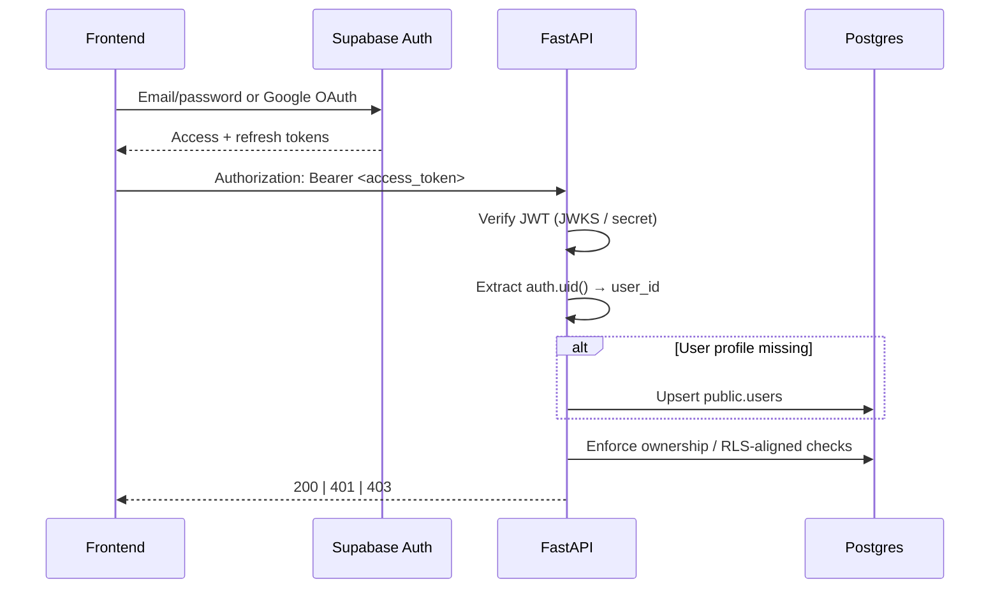
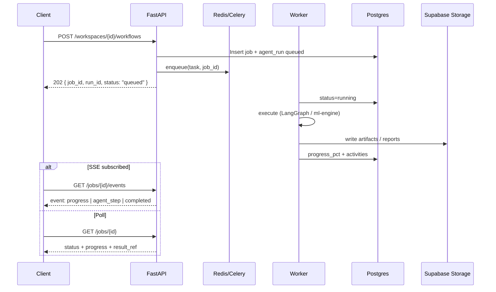

# 04 — API Architecture

## 1. Purpose

Defines the FastAPI surface for Syntrix AI: versioning, auth, resources, async jobs, streaming, errors, and pagination.

## 2. Style & versioning

- **Style:** Resource-oriented REST under `/api/v1`.
- **Streaming:** SSE under `/api/v1/.../events` for agent/job progress.
- **Content type:** `application/json` except multipart uploads and SSE (`text/event-stream`).
- **Versioning:** URL path version (`v1`). Breaking changes → `v2`; additive fields are non-breaking.
- **OpenAPI:** Generated from FastAPI; frontend types derived from OpenAPI in CI later.
- **Domain nesting:** Projects contain Experiment Workspaces; analysis endpoints are primarily **workspace-scoped**.



## 3. Auth middleware flow (Supabase)



### Rules

- Unauthenticated: only health, auth callback helpers if any, OpenAPI (optional lock in prod).
- `401` invalid/expired token; `403` authenticated but not owner/member.
- Never trust `user_id` from body; always from JWT.
- Service role key used only in workers/backend server context—never shipped to FE.

## 4. Cross-cutting response patterns

### 4.1 Success envelope (optional consistency)

Two acceptable styles—pick one in Phase 1 and stick to it:

**A. Bare resources (preferred for REST purity):**

```json
{ "id": "...", "name": "Churn Analysis", "status": "active" }
```

**B. Envelope:**

```json
{ "data": { "id": "..." }, "meta": { "request_id": "..." } }
```

**Recommendation:** Bare resources + Problem Details for errors.

### 4.2 Error model (RFC 7807-inspired)

```json
{
  "type": "https://syntrix.local/errors/validation",
  "title": "Validation Error",
  "status": 422,
  "detail": "target_column is required for classification",
  "instance": "/api/v1/experiments",
  "request_id": "req_...",
  "errors": [
    { "field": "target_column", "message": "Field required" }
  ]
}
```

| Status | Use |
|--------|-----|
| 400 | Malformed request |
| 401 | Auth missing/invalid |
| 403 | Forbidden |
| 404 | Not found / hidden by ACL |
| 409 | Conflict (duplicate name, bad state transition) |
| 413 | Upload too large |
| 422 | Semantic validation |
| 429 | Rate limited |
| 202 | Accepted async job |
| 500 | Unexpected |
| 503 | Dependency unavailable |

### 4.3 Pagination

Cursor or offset for v1—**offset/limit** is fine for portfolio scale:

`GET /api/v1/workspaces/{id}/datasets?limit=20&offset=0`

```json
{
  "items": [],
  "limit": 20,
  "offset": 0,
  "total": 134
}
```

Default `limit=20`, max `100`.

### 4.4 Idempotency

For create-job endpoints, support `Idempotency-Key` header; store hash with job for 24h (Postgres) to prevent double AutoML launches.

## 5. Async job pattern (Celery)

Redis is used **only** as the Celery broker. Job status and progress are durable in Postgres.



### Job states

`queued → running → succeeded | failed | cancelled`

### Cancellation

`POST /api/v1/jobs/{job_id}/cancel` → cooperative cancel flag; workers checkpoint between pipeline stages (LangGraph state in **PostgreSQL**).

## 6. Resource groups & key endpoints

Base: `/api/v1`

### 6.1 Health

| Method | Path | Notes |
|--------|------|-------|
| GET | `/health` | Liveness |
| GET | `/ready` | Postgres (+ Celery/Redis broker) checks |

### 6.2 Auth / me

Auth primarily via Supabase client on FE. API exposes:

| Method | Path | Notes |
|--------|------|-------|
| GET | `/me` | Current user profile |
| PATCH | `/me` | display_name, preferences |

### 6.3 Projects

| Method | Path | Notes |
|--------|------|-------|
| GET | `/projects` | List own |
| POST | `/projects` | Create |
| GET | `/projects/{project_id}` | Detail |
| PATCH | `/projects/{project_id}` | Update |
| DELETE | `/projects/{project_id}` | Soft delete |

### 6.4 Experiment Workspaces

| Method | Path | Notes |
|--------|------|-------|
| GET | `/projects/{project_id}/workspaces` | List workspaces |
| POST | `/projects/{project_id}/workspaces` | Create workspace |
| GET | `/workspaces/{workspace_id}` | Detail |
| PATCH | `/workspaces/{workspace_id}` | Update |
| DELETE | `/workspaces/{workspace_id}` | Soft delete |
| GET | `/workspaces/{workspace_id}/timeline` | Agent execution history summary |

### 6.5 Datasets & versions

Uploads land in **Supabase Storage**. Logical datasets are project-scoped; versions are workspace-scoped.

| Method | Path | Notes |
|--------|------|-------|
| GET | `/projects/{project_id}/datasets` | List project datasets |
| POST | `/workspaces/{workspace_id}/datasets/upload` | Multipart → Storage → create dataset + version → enqueue profile |
| GET | `/workspaces/{workspace_id}/dataset-versions` | List versions in workspace |
| GET | `/dataset-versions/{version_id}` | Detail + status |
| GET | `/dataset-versions/{version_id}/metadata` | Profile/schema |
| GET | `/dataset-versions/{version_id}/preview` | First N rows (capped) |
| DELETE | `/datasets/{dataset_id}` | Soft delete + storage GC job |

### 6.6 Workflows / agents

Workflows are **workspace-scoped**.

| Method | Path | Notes |
|--------|------|-------|
| POST | `/workspaces/{workspace_id}/workflows` | Start graph (`eda`, `automl`, `explain`, `report`, `custom`) |
| GET | `/workflows/{run_id}` | Agent run status + summary |
| GET | `/workflows/{run_id}/events` | SSE agent stream |
| POST | `/workflows/{run_id}/resume` | Human-in-the-loop resume |
| GET | `/workspaces/{workspace_id}/agent-runs` | Execution history |
| GET | `/workspaces/{workspace_id}/agent-activities` | Timeline |

**Example start body:**

```json
{
  "workflow_type": "automl",
  "dataset_version_id": "uuid",
  "input": {
    "task_type": "classification",
    "target_column": "churned",
    "algorithms": ["xgboost", "lightgbm", "random_forest"],
    "time_budget_minutes": 20
  }
}
```

**202 response:**

```json
{
  "run_id": "uuid",
  "job_id": "uuid",
  "workspace_id": "uuid",
  "status": "queued",
  "events_url": "/api/v1/workflows/{run_id}/events"
}
```

### 6.7 Experiments

| Method | Path | Notes |
|--------|------|-------|
| GET | `/workspaces/{workspace_id}/experiments` | List |
| GET | `/experiments/{experiment_id}` | Detail + metrics |
| POST | `/workspaces/{workspace_id}/experiments` | Direct create/train (thin wrapper over workflow) |
| POST | `/experiments/{experiment_id}/cancel` | Cancel |

### 6.8 Models

| Method | Path | Notes |
|--------|------|-------|
| GET | `/workspaces/{workspace_id}/models` | List |
| GET | `/models/{model_id}` | Detail |
| POST | `/models/{model_id}/champion` | Mark champion |
| GET | `/models/{model_id}/explanations` | Cached SHAP/LIME summary |
| POST | `/models/{model_id}/explain` | Enqueue explain job |

### 6.9 Predictions

| Method | Path | Notes |
|--------|------|-------|
| POST | `/models/{model_id}/predictions` | Single or batch (async if large) |
| GET | `/predictions/{prediction_id}` | Result + optional explanation |

### 6.10 Reports (Markdown + PDF)

| Method | Path | Notes |
|--------|------|-------|
| GET | `/workspaces/{workspace_id}/reports` | List |
| POST | `/workspaces/{workspace_id}/reports` | Enqueue generation (MD + PDF) |
| GET | `/reports/{report_id}` | Metadata + content links |
| GET | `/reports/{report_id}/download` | Signed URL; `?format=md\|pdf` |

**Create body may include:** `formats: ["markdown", "pdf"]` (default both in v1).

### 6.11 Conversations

| Method | Path | Notes |
|--------|------|-------|
| GET | `/workspaces/{workspace_id}/conversations` | List |
| POST | `/workspaces/{workspace_id}/conversations` | Create |
| GET | `/conversations/{id}` | With messages (paginated) |
| POST | `/conversations/{id}/messages` | User message → may enqueue agent turn |
| GET | `/conversations/{id}/events` | SSE for assistant streaming |

### 6.12 Jobs

| Method | Path | Notes |
|--------|------|-------|
| GET | `/jobs/{job_id}` | Status (Postgres) |
| GET | `/jobs/{job_id}/events` | SSE |
| POST | `/jobs/{job_id}/cancel` | Cancel |

## 7. SSE event schema

```json
{
  "event": "agent_step",
  "job_id": "uuid",
  "run_id": "uuid",
  "workspace_id": "uuid",
  "ts": "2026-08-01T10:00:00Z",
  "data": {
    "agent_name": "ml_engineer",
    "activity_type": "tool_call",
    "message": "Training LightGBM fold 2/5",
    "progress_pct": 42,
    "payload": {}
  }
}
```

Event names: `progress`, `agent_step`, `checkpoint`, `completed`, `failed`, `heartbeat`.

## 8. Upload security

- Target: **Supabase Storage** with per-user/project/workspace prefixes.
- Max size configurable (e.g., 100MB demo / higher in prod).
- Allowlist: `.csv`, `.parquet`, `.xlsx`, `.xls`.
- Reject polyglot / active content; never serve as HTML.
- Async malware scan hook (optional container) before version `status=ready`.
- Preview endpoint strips formulas from Excel cells where applicable.

## 9. API protection

- CORS: explicit frontend origins.
- Rate limit: per IP + per `user_id` (in-process or edge middleware; Redis not required).
- Request size limits; timeout budgets for sync routes (<30s).
- Security headers via reverse proxy (CSP, HSTS in prod).
- Audit sensitive actions to `system_logs`.

## 10. Mapping to services

| Endpoint group | Primary service | Engine |
|----------------|-----------------|--------|
| workspaces | WorkspaceService | — |
| datasets upload/profile | DatasetService | ml-engine profiling + Supabase Storage |
| workflows / agent-runs | WorkflowService | ai-engine graphs (Postgres checkpointer) |
| experiments/models | ExperimentService | ml-engine + MLflow |
| predictions | PredictionService | ml-engine |
| reports | ReportService | ai-engine report graph + MD/PDF render |
| conversations | ConversationService | ai-engine chat graph + pgvector memory |

## 11. Related documents

- [01-system-architecture.md](./01-system-architecture.md)
- [02-database-schema.md](./02-database-schema.md)
- [05-ai-agent-workflow.md](./05-ai-agent-workflow.md)
