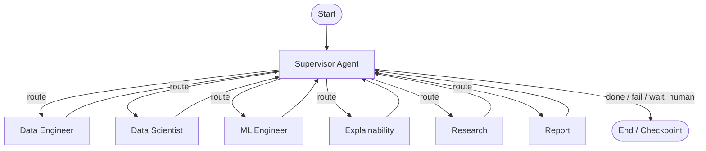
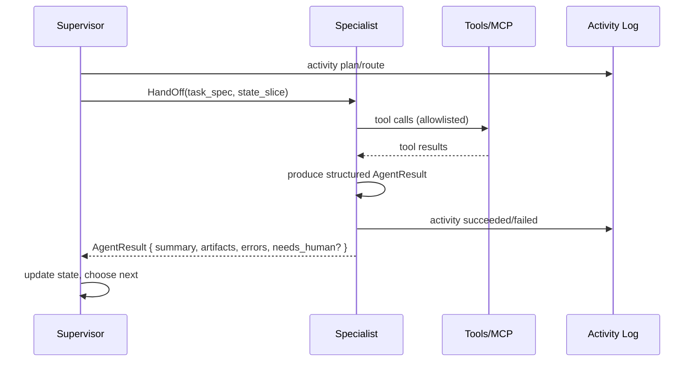
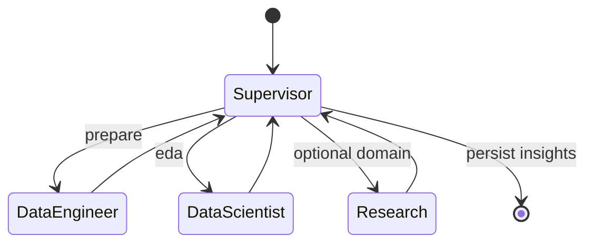
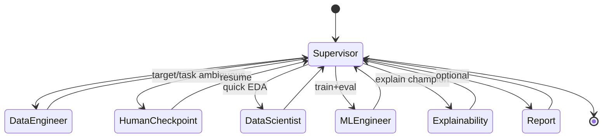
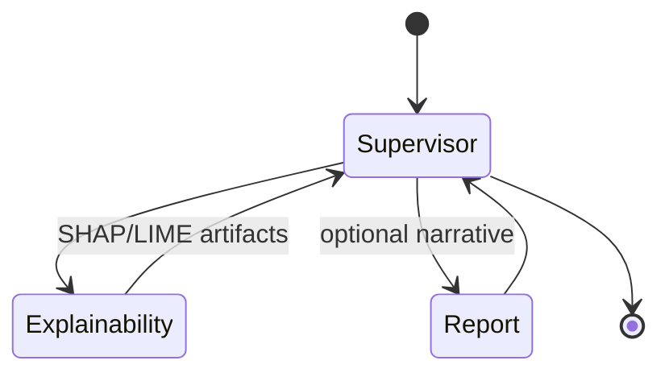
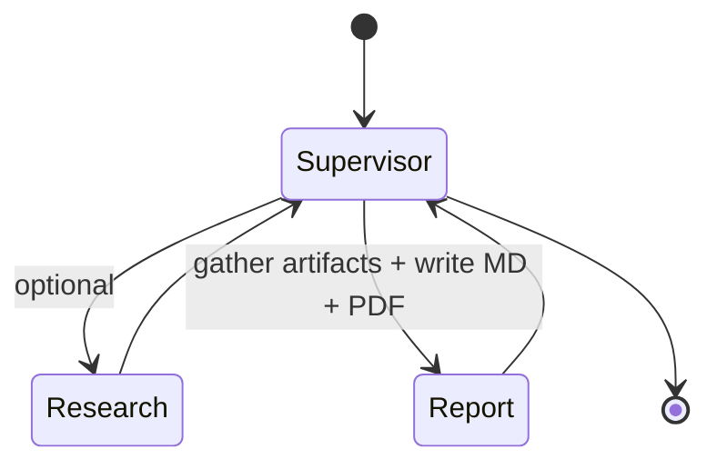
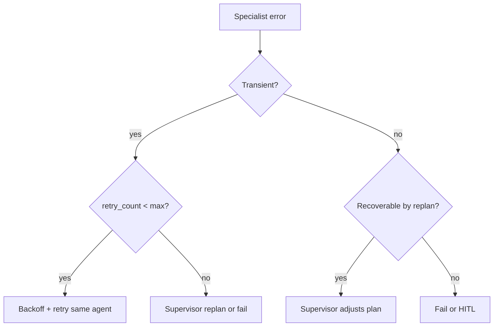

# 05 — AI Agent Workflow Design

## 1. Purpose

Defines the LangGraph multi-agent system: supervisor pattern, agent responsibilities, shared state, example workflows, and failure/HITL controls.

## 2. Supervisor pattern



**Supervisor duties:** interpret user goal + workspace context; produce a short plan; dispatch specialists; merge results; decide next hop or termination; request human input when blocked.

Specialists do **not** call each other directly; they return to the supervisor with structured results. This keeps graphs auditable and simplifies retries.

**Scope:** All runs are bound to an **Experiment Workspace** (`workspace_id`). Memory, artifacts, and execution history are workspace-scoped under a parent Project.

## 3. AI provider abstraction

Agents never call a vendor SDK directly. The `ai-engine` exposes ports and env-selected adapters:

| Port | Purpose |
|------|---------|
| `ChatModel` | Completions / tool-capable chat for agents |
| `EmbeddingModel` | Embeddings for pgvector memory / RAG |

| Adapter | Role |
|---------|------|
| `OllamaAdapter` | **Primary** local provider |
| `OpenAICompatibleAdapter` | Optional OpenAI-compatible APIs |

Selection via environment (`AI_PROVIDER`, `AI_BASE_URL`, `AI_MODEL`, `EMBEDDING_MODEL`, keys). No hardcoded vendor lock-in.

## 4. Agent responsibilities & tools

| Agent | Mission | Typical tools (via MCP / ml-engine) | Outputs |
|-------|---------|--------------------------------------|---------|
| **Supervisor** | Plan, route, synthesize | Memory retrieve/write (pgvector), activity log | Plan, final summary, routing decisions |
| **Data Engineer** | Validate, clean, prepare datasets | File MCP (Supabase Storage), DB MCP, profiling APIs | Clean dataset ref, quality report, prep config |
| **Data Scientist** | EDA, stats, insight discovery | File MCP, stats routines, viz spec builders | Insights, chart specs, hypothesis notes |
| **ML Engineer** | Train/compare models | ml-engine pipeline, MLflow | Experiment/model records, metrics |
| **Explainability** | Explain models/predictions | SHAP/LIME via ml-engine | Explanation artifacts |
| **Research** | Domain/context enrichment | Research MCP | Citations, briefings |
| **Report** | Narrative deliverables | File MCP (write MD/PDF), memory | Report docs (Markdown + PDF) + outline |

### Tool access matrix

| Tool surface | DE | DS | ML | EX | RS | RP | Sup |
|--------------|----|----|----|----|----|----|-----|
| File MCP read | ✓ | ✓ | ✓ | ✓ | | ✓ | ✓ |
| File MCP write (sandbox) | ✓ | | ✓ | | | ✓ | |
| Database MCP (scoped) | ✓ | ✓ | ✓ | | | | ✓ |
| Research MCP | | ○ | | | ✓ | ✓ | ○ |
| ml-engine train/eval | | | ✓ | | | | |
| ml-engine explain | | | ○ | ✓ | | | |
| ml-engine report PDF | | | | | | ✓ | |
| Vector memory (pgvector) | ✓ | ✓ | ✓ | ✓ | ✓ | ✓ | ✓ |

○ = optional / limited

## 5. Graph state schema

Conceptual TypedDict / Pydantic model for LangGraph state:

```text
AgentGraphState
  run_id: UUID                 # agent_runs.id
  job_id: UUID
  user_id: UUID
  project_id: UUID
  workspace_id: UUID           # Experiment Workspace (required)
  workflow_type: eda | automl | explain | report | chat | custom
  goal: str
  dataset_version_id: UUID | null
  experiment_id: UUID | null
  model_id: UUID | null
  conversation_id: UUID | null

  plan: list[PlanStep]
  current_agent: str | null
  messages: list[Message]          # supervisor ↔ specialists / user
  artifacts: dict[str, ArtifactRef] # cleaned_uri, charts, report_md, report_pdf, …
  metrics: dict[str, Any]
  insights: list[Insight]
  errors: list[ErrorItem]
  retry_count: int
  status: running | waiting_human | succeeded | failed | cancelled
  human_checkpoint: HumanCheckpoint | null
  memory_hits: list[MemoryHit]
  config: WorkflowConfig           # budgets, algorithms, HITL flags, report formats
```

**Reducers:** `messages` and `insights` append; `artifacts` merge by key; `errors` append; `retry_count` replace.

## 6. Handoff protocol



`AgentResult` (contract):

```json
{
  "agent": "data_scientist",
  "ok": true,
  "summary": "Found strong correlation between tenure and churn",
  "artifacts": { "eda_bundle": "storage://..." },
  "insights": [{ "title": "...", "confidence": 0.8 }],
  "metrics": {},
  "needs_human": false,
  "suggested_next": ["ml_engineer"]
}
```

Supervisor may ignore `suggested_next` if the master plan differs.

## 7. Example workflows

### 7.1 EDA only



**Triggers:** `workflow_type=eda` on a workspace.  
**Success criteria:** `dataset_metadata` enriched for the version; ≥N insight cards; chart specs stored; embeddings written to pgvector; job succeeded.

### 7.2 Full AutoML



**Budgets:** `time_budget_minutes`, `max_models`, algorithm allowlist from request.  
**Champion selection:** ml-engine comparison metrics → supervisor confirms → `models.is_champion=true`.

### 7.3 Explain existing model



Requires `model_id` + feature schema compatibility check before tools run.

### 7.4 Report generation (Markdown + PDF)



Report agent pulls experiments/models/insights via Database MCP + File MCP; writes **Markdown and PDF** to Supabase Storage (v1 scope includes both formats).

### 7.5 Conversational turn (chat)

Supervisor-light graph: retrieve workspace memory (pgvector) → optionally route one specialist → stream assistant message → write memory.

## 8. Error handling, retry, HITL

### 8.1 Error classes

| Class | Examples | Policy |
|-------|----------|--------|
| Transient | LLM 429, network blip | Retry w/ exponential backoff (max 3) |
| Tool/validation | Bad column name, schema mismatch | Specialist returns `ok=false`; supervisor replans once |
| Budget exceeded | Time/model cap | Stop gracefully; return partial results |
| Fatal | Corrupt dataset, auth scope error | Fail job; surface actionable error |
| Ambiguity | Multiple target candidates | `waiting_human` checkpoint |

### 8.2 Retry node



### 8.3 Human-in-the-loop checkpoints

Persisted in DB (`agent_activities.status=waiting_human`, `agent_runs.status=waiting_human`) + state `human_checkpoint`:

```json
{
  "checkpoint_id": "uuid",
  "reason": "select_target_column",
  "options": ["churned", "exited_flag"],
  "prompt": "Which column should we predict?",
  "timeout_hours": 24
}
```

Resume via `POST /workflows/{run_id}/resume` with user decision; worker rehydrates LangGraph state from the **PostgreSQL checkpointer** (approved; Redis is not used for checkpoints). `agent_runs.checkpoint_thread_id` correlates the product run with the checkpointer thread.

## 9. Observability of agents

Every node entry/exit writes `agent_activities` (linked to `agent_runs`) and emits SSE:

- `plan`, `route`, `tool_call`, `tool_result` (truncated), `handoff`, `checkpoint`, `final`.

Payloads must **redact secrets** and truncate large tool outputs (store full blobs in Supabase Storage if needed).

## 10. Prompt & versioning discipline

- Prompts stored as versioned files beside agents (`ai-engine/agents/.../prompts/vN.md`) at implementation time.
- Graph compilation pins prompt versions and provider/model ids in `config_json` of the run for reproducibility.
- Temperature low for Supervisor routing; specialists may vary.

## 11. Concurrency & isolation

- One active AutoML run per dataset version by default (409 on conflict) to protect resources.
- Workers set process-level env for workspace sandbox paths before MCP calls.
- LLM calls carry `user_id` / `project_id` / `workspace_id` in telemetry metadata for cost attribution.

## 12. Related documents

- [06-mcp-architecture.md](./06-mcp-architecture.md)
- [04-api-architecture.md](./04-api-architecture.md)
- [01-system-architecture.md](./01-system-architecture.md)
