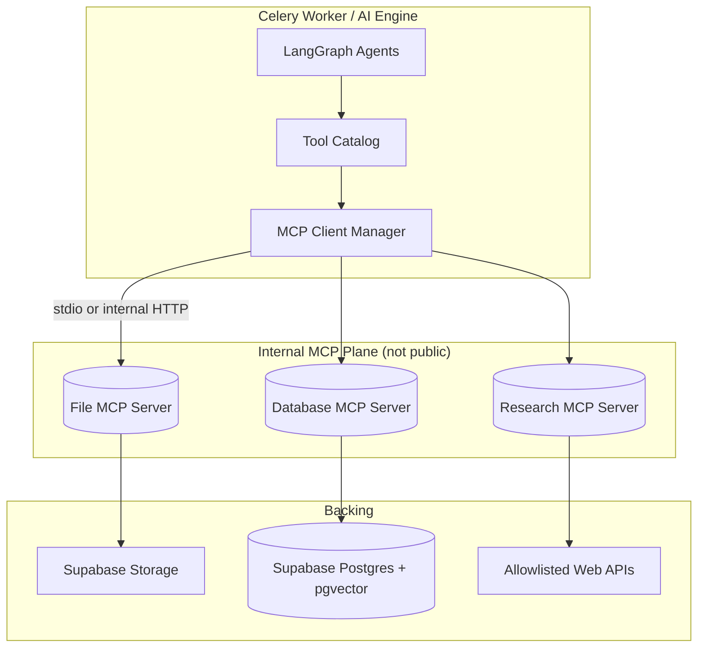
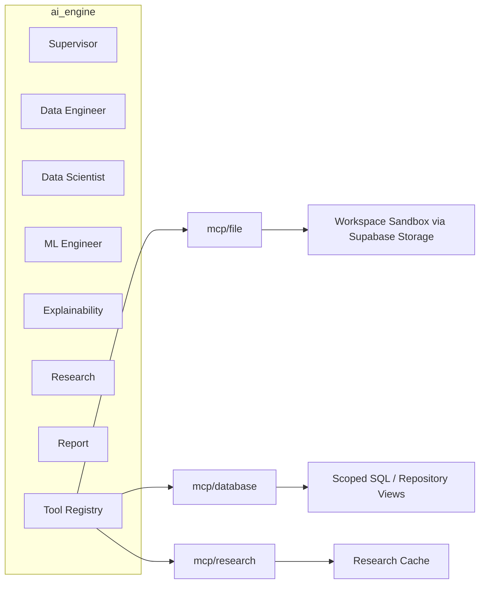
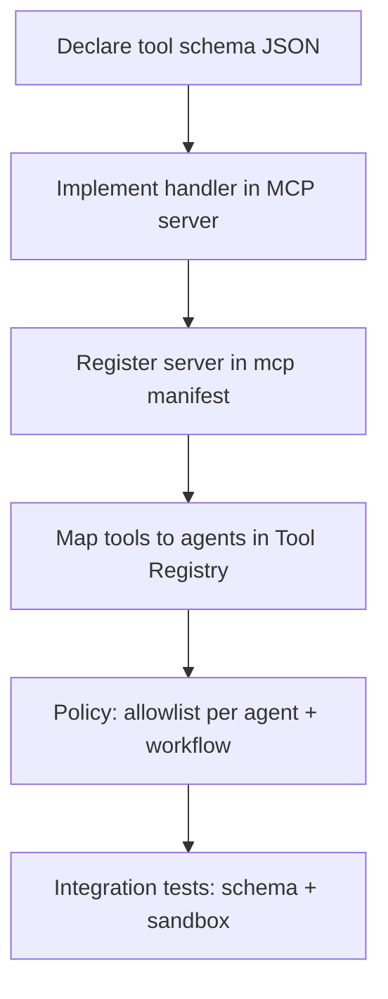

# 06 — MCP Architecture Design

## 1. Purpose

Defines how Model Context Protocol (MCP) servers provide modular, sandboxed tools to Syntrix agents: placement, contracts, registration, and security.

## 2. Placement relative to agents



**Decision (approved):** MCP servers run as **sidecar processes** on the worker network (Compose services or supervised subprocesses). Agents never embed raw filesystem or SQL strings; they call typed MCP tools through the client manager.

**File backing (approved):** **Supabase Storage** is the primary object store. File MCP resolves sandbox paths to Storage keys (optional local cache for worker performance). MinIO/S3/local filesystem are not primary.

**Transport:** Prefer **stdio** for local Compose simplicity; switch to internal HTTP/SSE MCP transport if servers must scale independently.

## 3. Component diagram



## 4. Server contracts

### 4.1 File MCP (`mcp/file`)

**Role:** Safe read/write/list within a project/workspace sandbox on **Supabase Storage**; dataset and artifact access (including Markdown/PDF reports).

| Tool | Input | Output | Notes |
|------|-------|--------|-------|
| `list_files` | `project_id`, `workspace_id`, `prefix` | entries[] | Prefix must be inside sandbox |
| `read_text` | `path`, `max_bytes` | text | Reject binaries |
| `read_table_preview` | `path`, `n_rows` | columns + rows | CSV/Parquet/XLSX |
| `write_text` | `path`, `content` | uri | Markdown/reports/configs |
| `write_bytes` | `path`, `content_b64` | uri | Size-capped artifacts (PDF, etc.) |
| `stat_file` | `path` | size, hash, mime | |
| `resolve_dataset_version` | `dataset_version_id` | storage path + format | Via backend-issued capability token |

**Sandbox root:** Storage prefix `/{bucket}/{user_id}/{project_id}/{workspace_id}/...`  
**Denied:** path traversal (`..`), keys outside prefix, shell execution, arbitrary internet downloads.

### 4.2 Database MCP (`mcp/database`)

**Role:** Structured access to Syntrix metadata and approved analytical queries—not arbitrary DBA power. Includes workspace-scoped reads and agent execution history writes.

| Tool | Input | Output | Notes |
|------|-------|--------|-------|
| `get_project` | `project_id` | project json | Ownership checked |
| `get_workspace` | `workspace_id` | workspace json | |
| `get_dataset_version` | `dataset_version_id` | version + metadata | |
| `list_experiments` | `workspace_id`, filters | items[] | |
| `get_model` | `model_id` | model json | |
| `log_agent_activity` | activity payload | id | Write audit trail |
| `update_job_progress` | `job_id`, `pct`, `message` | ok | Durable in Postgres |
| `run_readonly_sql` | `sql`, `params` | rows | **Optional, tightly gated** |

**SQL policy (if enabled):**

- Allow only `SELECT` against a **whitelist of views** (`analytics.*`).
- Statement timeout; row limit; no multiple statements.
- Prefer dedicated repository tools over freeform SQL in v1.

### 4.3 Research MCP (`mcp/research`)

**Role:** Fetch external context for domain understanding and report citations.

| Tool | Input | Output | Notes |
|------|-------|--------|-------|
| `search` | `query`, `max_results` | results[{title,url,snippet}] | Allowlisted providers |
| `fetch_page` | `url` | extracted text | SSRF protections |
| `summarize_sources` | `source_ids` | brief | May call LLM via provider abstraction or return raw for agent |

**SSRF controls:** block private IP ranges, link-local, metadata endpoints; HTTPS only; redirect limits; content size caps; domain allowlist mode for demos.

## 5. Capability tokens (binding tools to auth context)

When a job starts, the API/worker mints a short-lived **capability** injected into MCP client headers/env:

```json
{
  "user_id": "uuid",
  "project_id": "uuid",
  "workspace_id": "uuid",
  "job_id": "uuid",
  "scopes": ["file:read", "file:write", "db:read", "db:write_activity", "research:search"],
  "sandbox_root": "supabase://bucket/user/project/workspace",
  "exp": 1735689600
}
```

MCP servers validate capability signature (HMAC with server secret) before every tool call. Agents cannot widen scopes.

## 6. Tool registration



### Manifest (design)

`mcp/manifest.yaml` (future file) lists servers, transports, and tool names.  
`ai-engine/tools/registry.py` (future) binds:

- agent name → allowed tool names
- workflow_type → additional restrictions (e.g., EDA cannot call `train_model` even if ML agent is absent)

### Adding a new tool (process)

1. Spec the tool in the appropriate MCP server contract (this doc + OpenAPI-like JSON schema).
2. Implement server handler with validation + sandbox checks.
3. Add allowlist entries for agents that need it.
4. Add security review notes (data egress? write?).
5. Add integration tests with fixtures.
6. Bump tool catalog version; record in workflow `config_json`.

## 7. Security & sandboxing

| Control | Implementation |
|---------|----------------|
| Network exposure | MCP ports bound to internal Docker network only |
| AuthN/Z | Capability tokens + per-call scope checks |
| Storage | Prefix validation against Supabase Storage sandbox; no key escape |
| DB | Least privilege DB role for MCP; RLS still applies when using user JWT; service role only for stamped job context |
| Research egress | Allowlist + SSRF protections + cache |
| Secrets | MCP servers read env secrets; never return secrets in tool outputs |
| Output hygiene | Truncate large payloads; scrub `Authorization`, API keys via regex filters |
| Auditing | Every tool call → structured log + optional `agent_activities` |

### Threat notes

- **Prompt injection → tool abuse:** mitigated by allowlists, capability scopes, and refusing destructive DB tools.
- **Data exfiltration via Research MCP:** disable or restrict in sensitive deployments; log all fetched URLs.
- **Path / key traversal:** normalize Storage keys; reject `..` and out-of-prefix paths.

## 8. Interaction with ml-engine

MCP is **not** a replacement for ml-engine. Training/evaluation/explain/PDF render calls are native Python interfaces invoked by the ML Engineer / Explainability / Report agents. MCP covers I/O and external world access.

Exception: a thin File MCP helper may locate artifacts in Supabase Storage that ml-engine then loads inside the worker process.

## 9. Local vs cloud topology

| Env | File backing | DB MCP | Research | AI provider |
|-----|--------------|--------|----------|-------------|
| Local Compose | **Supabase Storage** | Supabase Cloud / local CLI | Mock provider or real API keys | Ollama (primary) |
| Demo | Supabase Storage | Supabase Cloud | Live search (rate limited) | Ollama and/or OpenAI-compatible |
| Hardened | Supabase Storage (+ policies) | Supabase + restricted role | Allowlist only | Env-selected adapter |

## 10. Related documents

- [05-ai-agent-workflow.md](./05-ai-agent-workflow.md)
- [01-system-architecture.md](./01-system-architecture.md)
- [00-overview.md](./00-overview.md)
