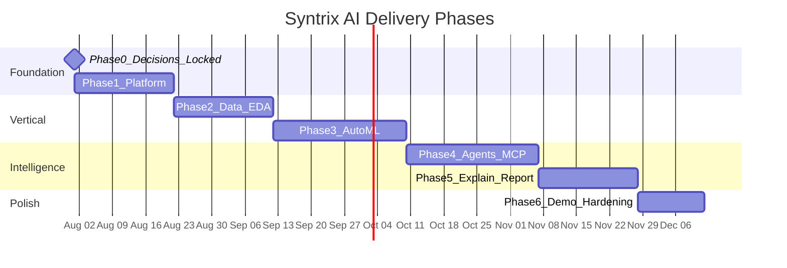
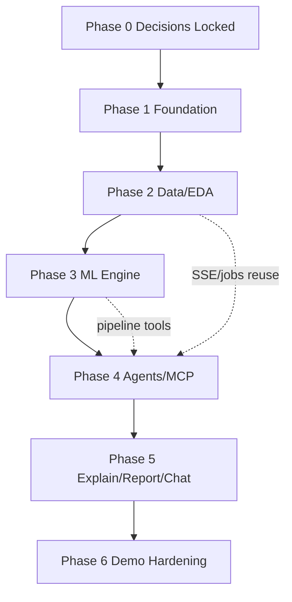

# 07 — Development Roadmap

## 1. Purpose

Phased delivery plan for a professional engineering team (or strong solo/portfolio execution). **Phase 0 technical decisions are approved.** Phases 1–6 are implemented in the monorepo for a portfolio-demo path.

## 2. Phase overview

## 3. Phase 0 — Architecture approval

**Status:** Documentation complete; Phase 0 decisions **locked**.

### Exit criteria

- [x] Major technology decisions recorded as approved in [00-overview.md §4](./00-overview.md)
- [x] Stakeholder review of docs / remaining non-blocking items in [00-overview.md §6](./00-overview.md) (defaults applied)
- [x] Explicit approval to begin Phase 1 (kickoff)

## 4. Phase 1 — Platform foundation

**Status:** Implemented.

### Milestones

| Milestone | Status | Deliverables |
|-----------|--------|--------------|
| 1.1 Repo bootstrap | [x] | Python/TS tooling, lint/format, `.env.example`, Compose skeleton |
| 1.2 Supabase | [x] | Schema migrations, auth, Storage buckets |
| 1.3 Backend core | [x] | FastAPI app, `/me`, projects + workspaces CRUD, JWT |
| 1.4 Frontend shell | [x] | Next.js dark enterprise shell, auth, navigation |
| 1.5 Jobs spine | [x] | Redis + Celery; `jobs` table; poll + SSE |

### Exit criteria

- [x] User can sign in, create a project and workspace, see a demo async job complete end-to-end.

## 5. Phase 2 — Datasets & EDA vertical

**Status:** Implemented.

**Goal:** Upload → version → profile → preview → basic insights UI (workspace-scoped).

### Milestones

| Milestone | Status | Deliverables |
|-----------|--------|--------------|
| 2.1 Upload | [x] | Secure upload API + Supabase Storage; dataset states |
| 2.2 Profiling | [x] | ml-engine validate/profile; `dataset_metadata` + `eda_json` |
| 2.3 Preview | [x] | Preview API + table UI |
| 2.4 EDA v1 | [x] | Statistical summaries + Recharts (no multi-agent required) |
| 2.5 SSE | [x] | Job progress events for profiling/EDA |

### Exit criteria

- [x] Upload CSV into a workspace → automatic profile → interactive EDA page.

## 6. Phase 3 — ML engine & experiments

**Status:** Implemented.

### Milestones

| Milestone | Status | Deliverables |
|-----------|--------|--------------|
| 3.1 Pipeline | [x] | validate → clean → features → train → eval → predict |
| 3.2 Algorithms | [x] | RF, LogReg/Ridge, XGBoost (+ KMeans clustering) |
| 3.3 Tasks | [x] | Classification + regression + clustering |
| 3.4 MLflow | [x] | Optional Compose profile; `mlflow_run_id` linked when reachable |
| 3.5 UI | [x] | Experiment/model list; champion selection; predict API |

### Exit criteria

- [x] User runs train job in a workspace; sees metrics; selects champion; can predict.

## 7. Phase 4 — Multi-agent orchestration & MCP

**Status:** Implemented (graceful degrade without Ollama).

### Milestones

| Milestone | Status | Deliverables |
|-----------|--------|--------------|
| 4.1 Graph core | [x] | State schema, supervisor, Postgres checkpointer (fallback linear runner) |
| 4.2 Providers | [x] | Ollama primary + OpenAI-compatible adapter |
| 4.3 Agents | [x] | Data Engineer, Data Scientist, ML Engineer (+ explain/report nodes) |
| 4.4 MCP | [x] | File + Database + Research servers with capability tokens / SSRF controls |
| 4.5 Workflows API | [x] | `eda` / `automl` / `explain` / `report` + SSE + `agent_runs` / activities |
| 4.6 Memory | [x] | `memory_chunks` writes; embeddings optional when provider available |

### Exit criteria

- [x] Agent timeline visible in UI for workflow runs; activities persisted.

## 8. Phase 5 — Explainability, research, reports, chat

**Status:** Implemented.

### Milestones

| Milestone | Status | Deliverables |
|-----------|--------|--------------|
| 5.1 Explainability | [x] | SHAP (+ coefficient fallback); explain API/UI |
| 5.2 Research MCP | [x] | Mock-by-default + SSRF-safe live fetch flag |
| 5.3 Report agent | [x] | Markdown + PDF → Storage; download API |
| 5.4 Conversations | [x] | Workspace chat with context + memory rows |
| 5.5 HITL | [x] | Target selection pause (`waiting_human`) + resume API |

### Exit criteria

- [x] Demo path: upload → AutoML → explain → MD+PDF report → chat follow-up.

## 9. Phase 6 — Portfolio demo hardening

**Status:** Implemented (baseline polish).

### Milestones

| Milestone | Status | Deliverables |
|-----------|--------|--------------|
| 6.1 UX polish | [x] | Workspace hub tabs, empty states, job progress, dark theme |
| 6.2 Security pass | [x] | Upload validation, owner paths, RLS from Phase 1, capability tokens |
| 6.3 Perf | [x] | Profiling sample caps; upload size limit; worker queues |
| 6.4 Docs | [x] | README quickstart + end-to-end demo script |
| 6.5 Sample data | [x] | `samples/demo_churn.csv` |

### Exit criteria

- [x] Cold-start demo documented for laptop/dev machine (~15–20 min with small CSV).

## 10. Cross-phase quality bar

| Practice | When |
|----------|------|
| Unit tests for ml-engine transforms | Phase 2+ (`tests/unit/test_ml_profile.py`) |
| API contract tests | Phase 1+ |
| Provider adapter smoke tests | Phase 4+ (manual / optional Ollama) |
| Agent tool allowlist tests | Phase 4+ (MCP capability scopes) |
| E2E happy path | Phase 5–6 (manual demo script in README) |
| No secrets in git | Always |

## 11. Suggested sequencing dependencies

## 12. Related documents

- [00-overview.md](./00-overview.md)
- [docs/README.md](./README.md)
