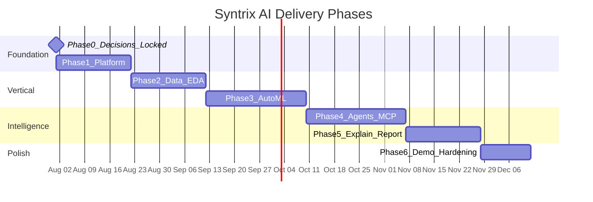
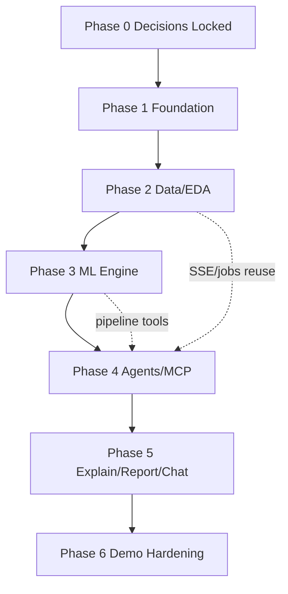

# 07 — Development Roadmap

## 1. Purpose

Phased delivery plan for a professional engineering team (or strong solo/portfolio execution). **Phase 0 technical decisions are approved.** Implementation waits for explicit **Phase 1 kickoff** approval.

## 2. Phase overview

Durations are indicative for a small team (2–4 engineers). Compress for portfolio MVP by narrowing algorithm set while keeping Markdown + PDF reports in scope.

## 3. Phase 0 — Architecture approval (current)

**Status:** Documentation complete; Phase 0 decisions **locked**; coding not started.

### Deliverables (done)

- System, DB, API, agent, MCP, folder, roadmap docs
- Approved stack: Supabase Storage, Ollama (+ OpenAI-compatible abstraction), PostgreSQL + pgvector, Postgres LangGraph checkpoints, Redis for Celery only, Markdown + PDF reports, Experiment Workspace domain model
- Empty monorepo scaffolding
- Design DDL sketch (workspaces, dataset versions, agent runs, memory_chunks)

### Exit criteria

- [x] Major technology decisions recorded as approved in [00-overview.md §4](./00-overview.md)
- [ ] Stakeholder review of docs / remaining non-blocking items in [00-overview.md §6](./00-overview.md)
- [ ] Explicit approval to begin Phase 1 (kickoff)

## 4. Phase 1 — Platform foundation

**Goal:** Runnable skeleton: auth, projects, experiment workspaces, API shell, Compose, CI basics.

### Milestones

| Milestone | Deliverables |
|-----------|--------------|
| 1.1 Repo bootstrap | Python/TS tooling, lint/format, `.env.example` (incl. `AI_PROVIDER`), Compose skeleton |
| 1.2 Supabase | Schema migrations from design DDL (pgvector, workspaces, RLS); auth (email + Google); Storage buckets |
| 1.3 Backend core | FastAPI app, `/me`, projects + workspaces CRUD, JWT middleware, error model |
| 1.4 Frontend shell | Next.js dark enterprise shell, auth pages, project → workspace navigation |
| 1.5 Jobs spine | Redis + Celery hello-task (**broker only**); `jobs` table; poll endpoint |

### Dependencies

- Supabase project + OAuth credentials + Storage
- Ollama available for local AI (or OpenAI-compatible credentials for optional path)

### Exit criteria

- User can sign in, create a project and workspace, see a demo async job complete end-to-end.

## 5. Phase 2 — Datasets & EDA vertical

**Goal:** Upload → version → profile → preview → basic insights UI (workspace-scoped).

### Milestones

| Milestone | Deliverables |
|-----------|--------------|
| 2.1 Upload | Secure upload API + **Supabase Storage**; dataset + dataset_version states |
| 2.2 Profiling | ml-engine validate/profile; `dataset_metadata` on versions |
| 2.3 Preview | Preview API + table UI |
| 2.4 EDA v1 | Statistical summaries + charts (Plotly/Recharts) without full multi-agent yet |
| 2.5 SSE | Job progress events for profiling/EDA |

### Dependencies

- Phase 1 complete
- File size limits decided (operational, not architecture-open)

### Exit criteria

- Upload CSV into a workspace → automatic profile → interactive EDA page for one demo dataset version.

## 6. Phase 3 — ML engine & experiments

**Goal:** Reusable pipeline + experiment tracking + model registry (app DB + MLflow), workspace-scoped.

### Milestones

| Milestone | Deliverables |
|-----------|--------------|
| 3.1 Pipeline | validate → clean → features → train → eval → predict contracts |
| 3.2 Algorithms | RF, LogReg, XGBoost/LightGBM (CatBoost/SVM/NN can follow) |
| 3.3 Tasks | Classification + regression first; clustering next; forecasting/anomaly as stretch |
| 3.4 MLflow | Tracking server in Compose; link `mlflow_run_id` |
| 3.5 UI | Experiment compare table; champion selection |

### Dependencies

- Profiled dataset versions from Phase 2
- Worker CPU sizing for local demos

### Exit criteria

- User runs train job in a workspace; sees metrics; selects champion; runs a single prediction.

## 7. Phase 4 — Multi-agent orchestration & MCP

**Goal:** LangGraph supervisor + specialists; MCP File/DB; replace ad-hoc EDA/train scripts with workspace-scoped agent workflows.

### Milestones

| Milestone | Deliverables |
|-----------|--------------|
| 4.1 Graph core | State schema (`workspace_id`), supervisor, **PostgreSQL checkpointer** |
| 4.2 Providers | AI provider abstraction: **Ollama** primary + OpenAI-compatible adapter |
| 4.3 Agents | Data Engineer, Data Scientist, ML Engineer wired |
| 4.4 MCP | File (Supabase Storage) + Database servers + capability tokens |
| 4.5 Workflows API | `eda` + `automl` workflows with SSE agent timeline + `agent_runs` |
| 4.6 Memory | **pgvector** workspace/conversation memory (`memory_chunks`) |

### Dependencies

- Provider env config + cost controls
- Phase 3 pipeline stable for ML Engineer tool calls

### Exit criteria

- Agent timeline visible in UI for AutoML run; tools sandboxed; activities persisted; checkpoints resume from Postgres.

## 8. Phase 5 — Explainability, research, reports, chat

**Goal:** Complete “virtual team” loop.

### Milestones

| Milestone | Deliverables |
|-----------|--------------|
| 5.1 Explainability agent | SHAP (+ LIME stretch); explain API/UI |
| 5.2 Research MCP | Search/fetch with SSRF controls (or mocked for demo) |
| 5.3 Report agent | **Markdown + PDF** generation, Storage upload, download API |
| 5.4 Conversations | Workspace chat with pgvector memory-augmented answers |
| 5.5 HITL | Target selection checkpoint + resume API/UI (Postgres checkpointer) |

### Exit criteria

- Demo script: upload → AutoML → explain → Markdown+PDF report → ask chat a follow-up.

## 9. Phase 6 — Portfolio demo hardening

**Goal:** Reliability, polish, narrative readiness.

### Milestones

| Milestone | Deliverables |
|-----------|--------------|
| 6.1 UX polish | Motion, empty states, agent visualization, workspace UX, dark theme consistency |
| 6.2 Security pass | Upload tests, RLS verification, Storage policies, secret scan, rate limits |
| 6.3 Perf | Reasonable defaults for demo dataset sizes; timeouts |
| 6.4 Docs | README quickstart, architecture link, demo script |
| 6.5 Sample data | 1–2 curated datasets + seed project/workspace |

### Exit criteria

- Cold-start demo under ~15–20 minutes on a laptop/dev machine with recorded fallback video if training is slow.

## 10. Cross-phase quality bar

| Practice | When |
|----------|------|
| Unit tests for ml-engine transforms | Phase 2+ |
| API contract tests | Phase 1+ |
| Provider adapter smoke tests | Phase 4+ |
| Agent tool allowlist tests | Phase 4+ |
| E2E happy path | Phase 5–6 |
| No secrets in git | Always |

## 11. Suggested sequencing dependencies

## 12. Explicit hold on implementation

> **Do not begin Phase 1 coding until Phase 1 kickoff is explicitly approved.** Phase 0 technology decisions (storage, AI providers, pgvector, Postgres checkpoints, Redis=Celery-only, report formats, Experiment Workspace) are **already approved** and documented. Remaining non-blocking items (local Supabase CLI vs cloud-only onboarding; multi-tenancy depth) may use the defaults in [00-overview.md §6](./00-overview.md).

## 13. Related documents

- [00-overview.md](./00-overview.md)
- [docs/README.md](./README.md)
